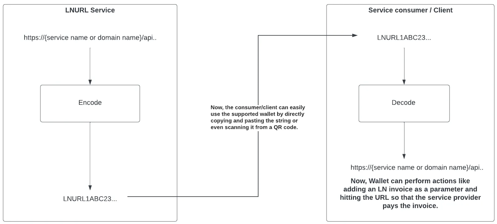
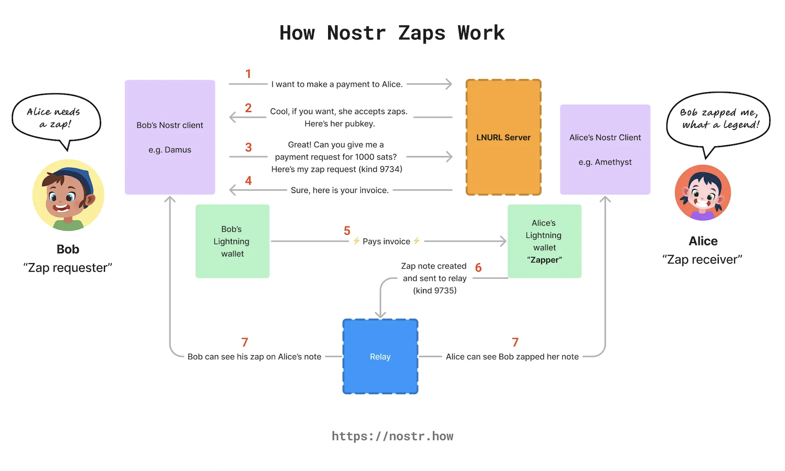

**A cura di**\
Andrea Dimauro\ 
Flavio Mastrorocco\ 
Sibilla Merlo\
Giulia Lydia Perini\
Paolo Tiecco\

Anno Accademico 2023-2024\

# Abstract

Il seguente progetto di ricerca ha come obiettivo primario quello di
studiare il concetto di *address reuse* e le relative tecniche di
mitigazione, tra cui silent payments.

La narrazione si sviluppa introducendo i cardini della tecnologia
Bitcoin, riassumendo quindi come avvengono le transazioni, come sono
calcolati e generati gli indirizzi (pubblici e privati) e come
quest'ultimi vengano utilizzati. La ricerca prosegue con l'approfondimento del
problema del riutilizzo degli indirizzi, evidenziando aspetti relativi a
privacy e sicurezza del proprietario.
Lo studio si espande analizzando alcune tecniche per limitare e mitigare
i difetti, le problematiche e gli effetti indesiderati dovute agli
*address reuse*. Vengono, infine, esplorati alcuni attacchi
informatici avvenuti sfruttando la ripetizione degli indirizzi
e vengono presentate le pratiche migliori da adottare per evitare
problematiche legate all'*address reuse*.

# Introduzione

## Bitcoin Blockchain

La tecnologia Bitcoin[@nakamoto2008bitcoin], introdotta nel 2008 da un
autore anonimo noto con lo pseudonimo di Satoshi Nakamoto, rappresenta
la prima implementazione di una criptovaluta basata su un sistema di
contabilità distribuita noto come blockchain. Questa tecnologia ha
inaugurato una nuova era nella economia digitale, combinando concetti di
crittografia, teoria dei giochi e informatica per creare una valuta
decentralizzata che opera senza la necessità di intermediari come banche
o istituzioni finanziarie.

::: tcolorbox
Con il termine **Blockchain** indichiamo un database distribuito, noto
anche come *Distributed Ledger Technology* (DLT), immutabile che
introduce il concetto di scarsità digitale.
:::

Tale database è in possesso di tutti gli utenti, i quali sono collegati
in una rete peer-to-peer. I nodi della rete aderiscono collettivamente
all'aggiunta di nuovi blocchi nel database grazie ad algoritmi del
consenso.

La blockchain possiede un'architettura lineare a catena formata da
blocchi. Ogni blocco è caratterizzato da un header, che contiene
informazioni cruciali per la corretta identificazione del blocco stesso,
e un body, che raccoglie un insieme di transazioni. Nell'header del
blocco è presente il campo `hashPrevBlock`, il quale contiene l'hash
dell'header del blocco precedente, garantendo così la struttura a
catena. Proprio per la sua natura e all'utilizzo delle funzioni di hash,
le transazioni registrate nella blockchain diventano irreversibili.I
dati contenuti in un determinato blocco non possono essere modificati
retroattivamente senza alterare tutti i blocchi successivi, rendendo
così la blockchain estremamente resistente alla manomissione e
garantendo l'integrità del sistema.

Va specificato che nella prima versione del codice di Bitcoin, Satoshi
Nakamoto utilizzò il termine **timechain** per descrivere la sequenza di
blocchi che costituiscono Bitcoin. Questa terminologia potrebbe essere
stata scelta a causa della natura sequenziale dei blocchi, che vengono
aggiunti approssimativamente ogni dieci minuti. Nello sviluppo del
progetto, però, tutte le referenze alla parola sono state rimosse e
sostituite da termini più generici come \"**chain**\" e \"*chain of
blocks*\". Nel corso del tempo il termine \"*blockchain*\" ha guadagnato
popolarità ed è stato ampiamente adottato, non solo nella comunità di
Bitcoin, diventando un termine di tendenza per descrivere qualsiasi
catena di blocchi interconnessi che mantengono registri di transazioni
in modo decentralizzato e sicuro. Per questo motivo, molti amanti della
tecnologia Bitcoin decidono di utilizzare ancora il termine
\"*timechain*\"; la seguente trattazione, per facilità di comprensione
verrà sviluppata mantenendo e utilizzando e il termine \"*blochckain*\".

## Indirizzi Bitcoin

La tecnologia Bitcoin prevede che per la generazione delle chiavi
asimmetriche si utilizzi un sistema ECC (*Elliptic Curve Cryptosystem*),
il quale permette la creazione di una chiave privata di 256 bit e la
corrispondente chiave pubblica anch'essa di 256 bit.

::: tcolorbox
Il sistema a curva ellittica utilizzato da Bitcoin prevede l'utilizzo
di:

-   **Curva**: $y^2=x^3+7$ anche nota con il nome Secp256k1;

-   **Campo**: $\mathbb{Z}_p$ dove
    $p=2^{256}-2^{32}-2^9-2^8-2^7-2^6-2^4-1$;

-   **Punto base**: $G=(x,y)$ dove $x,y$ in esadecimale valgono\
    $x = 79BE667EF9DCBC \cdot 10^{32}$\
    $y = 483ADA7726A3C4 \cdot 10^{32}$

-   **Numero di punti della curva**: in esadecimale $n=10^{40}$.
:::

Ogni utente seleziona casualmente $d \in \mathbb{Z}_p$ di 256 bit e
calcola $P=dG$ (punto appartenente alla curva), generando così la coppia
$\mathbf{(d,dG)}$ formata da **chiave privata** e **chiave pubblica**.

Come destinazione di un trasferimento Bitcoin, non vengono utilizzate
direttamente le chiavi pubbliche, ma si calcolano i cosiddetti indirizzi
Bitcoin.

::: tcolorbox
Per generare un indirizzo Bitcoin si procede nel seguente modo:

-   si calcola $S=$ `version byte` $||$
    `RIPEMD-160`(`SHA-256`$(K_{pub}))$;

-   si calcola il checksum $C = primi \; 4 \;bytes \; di$
    `SHA-256`(`SHA-256`($S$));

-   si calcola $S_{check} = S \;|| \;C$;

-   si ottiene l'indirizzo calcolando la codifica
    `Base58Check`($S_{check}$)
:::

Come si evince dalla trattazione, gli indirizzi Bitcoin sono
strettamente connessi alle chiavi pubbliche. La decisione di derivare
gli indirizzi dalle chiavi pubbliche, piuttosto che utilizzare
direttamente quest'ultime, è motivata principalmente da considerazioni
di sicurezza. Gli algoritmi di crittografia asimmetrica impiegati per la
generazione delle chiavi rappresentano attualmente lo stato dell'arte,
ovvero sono, ad oggi, considerati sicuri sia da un punto di vista
matematico che informatico. In particolare, ciò che rende il sistema
inviolabile, è l'assenza di un meccanismo efficiente che permetta di
derivare a partire da una chiave pubblica, la corrispondente chiave
privata, la quale consente l'accesso al wallet Bitcoin. Utilizzare
direttamente la chiave pubblica, esponendola alla rete, potrebbe, con
l'evoluzione delle capacità computazionali dei calcolatori o la scoperta
di nuovi algoritmi, rappresentare una minaccia irrimediabile alla
sicurezza del sistema. Per questo motivo gli indirizzi Bitcoin prevedono
l'utilizzo di una funzione di hash chiamata `RIPEMD-160`, che genera un
output di $160$ bit, e una funzione di codifica alfanumerica
`Base58Check`. Con questo approccio, inoltre, dal momento in cui si
utilizzano le funzioni di hash, `SHA-256` e `RIPEMD-160`, risulta
computazionalmente difficile risalire alla chiave pubblica
dall'Indirizzo Bitcoin che verrà resa pubblica solo quando i bitcoin
verranno nuovamente spesi.

È importante evidenziare che per via sia della scelta casuale della
stessa chiave privata, sia dell'utilizzo di una funzione di hash, si
potrebbero verificare delle collisioni. La probabilità che ciò accada,
però, è molto bassa e pertanto il sistema è considerato funzionante e
sicuro.

## Transazioni Bitcoin

Le transazioni Bitcoin rappresentano il nucleo operativo del protocollo
Bitcoin, fungendo da meccanismo primario attraverso il quale gli utenti
trasferiscono valore all'interno della rete. Ogni transazione è
un'istruzione crittografica che sposta una quantità specifica di bitcoin
da uno o più indirizzi di input a uno o più indirizzi di output. Queste
transazioni sono registrate nel registro pubblico della blockchain,
garantendo trasparenza e sicurezza senza necessità di un'autorità
centrale.

Ogni transazione è identificata da un codice hash ed è composta da
elementi chiave come:

-   **Input e numero di input**: l'input è rappresentato da uno o più
    indirizzi Bitcoin utilizzati per finanziare la transazione. Ogni
    input è un riferimento a un output di una transazione precedente che
    ancora non è stato speso detto UTXO.

-   **Output e numero di output**: l'output è rappresentato da uno o più
    indirizzi Bitcoin su cui verranno trasferiti i fondi.

-   **Lock time**: tempo di attesa minimo per l'inserimento della
    transazione in un blocco.

La differenza tra i fondi trasferiti in ingresso rispetto a quelli in
uscita determina il valore delle commissioni che si è disposti a pagare
ai miners per l'inserimento della transazione in un blocco.

Per effettuare una transazione sulla rete Bitcoin, l'emittente deve
quindi avere accesso sia agli indirizzi pubblici di output, sia alle
chiavi private associate agli indirizzi di input.

::: esempio
**Esempio 2.1**. *Si ipotizzi che l'utente $A$ voglia inviare all'utente
$B$ la somma di $1$ BTC. Si supponga che $A$ abbia a disposizione 3
indirizzi Bitcoin con una disponibilità totale complessiva di $1.5$
BTC.*

<figure>

</figure>

*Ogni transazione Bitcoin prevede l'esaurimento del saldo nei wallet in
input. Di conseguenza, se l'utente $A$ desidera inviare solo una parte
del proprio saldo all'utente $B$, $A$ deve decidere se lasciare il resto
come commissione (fee) per la transazione o se recuperare il saldo
rimanente. Nel caso in cui $A$ desideri recuperare la differenza tra la
disponibilità e l'importo effettivamente speso, dovrà inserire un
proprio indirizzo tra gli output della transazione. Si consiglia che $A$
crei un nuovo indirizzo Bitcoin per questo scopo, al fine di limitare le
informazioni rivelate alla rete e mantenere un livello più elevato di
privacy. Questi indirizzi vengono chiamati **indirizzi di ritorno** o
**indirizzi di cambio**.*

<figure>

</figure>
:::

Si conclude che, generalmente, gli indirizzi di input e di output sono
multipli, per questo motivo all'interno dell'header della transazione
viene indicato il numero degli indirizzi oltre che ai loro effettivi
valori.

# Address reuse {#AddressReuse}

Il seguente capitolo ha come obiettivo quello di concentrarsi sul
concetto dell'address reuse e di studiare come esso possa generare
problemi di privacy, profilazione e sicurezza agli utilizzatori di
Bitcoin. Con il termine **address reuse** si intende l'utilizzo ripetuto
dello stesso indirizzo per più transazioni. Questa pratica, generalmente
non intenzionale, compromette la privacy e la sicurezza dei partecipanti
alla transazione. Il riutilizzo degli indirizzi permette di stabilire
facilmente un collegamento tra un indirizzo e il suo proprietario.
Poiché tutte le transazioni in Bitcoin sono firmate digitalmente tramite
la chiave privata del proprietario, chiunque abbia possibilità di
visionare le transazioni può analizzare la cronologia dell'indirizzo e
ottenere informazioni sul possessore.

Commettere *address reuse* significherebbe quindi trattare gli indirizzi
Bitcoin come un normale conto corrente bancario dove il singolo
indirizzo viene utilizzato per transazioni multiple. Gli indirizzi di
Bitcoin non sono ideati per essere utilizzati in questo modo e il fatto
che vengano utilizzati così, non è un errore nel design della tecnologia
di Bitcoin, ma un puro caso. Non c'è alcuna restrizione sul numero di
indirizzi Bitcoin che un utente possa avere e il design è fatto in
maniera tale che, per ogni transazione, un nuovo indirizzo Bitcoin
dovrebbe essere creato.

Nel capitolo precedente \[§[2](#intro){reference-type="ref"
reference="intro"}\], in particolare nella sezione relativa alle
transazioni, il problema dell'\
*address reuse* si collega agli indirizzi chiamati **indirizzi di
ritorno** o **indirizzi di cambio**.

Il **grafico** o **grafo delle relazioni**, che nel contesto di Bitcoin
si riferisce a una rappresentazione grafica delle transazioni tra
indirizzi sulla blockchain di Bitcoin, è fortemente collegato al
problema, in quanto tutti gli input ad uno specifico indirizzo saranno
necessariamente uniti (tramite la \"spending authority\" della chiave
privata) a tutti i suoi output.

Sono state inoltre condotte ricerche significative nell'area di ciò che
i ricercatori chiamano *identity collapse*, che si verifica quando è
possibile raccogliere informazioni sull'identità reale dell'utente
blockchain e di informazioni personali a seguito di analisi di vario
tipo. L'*address reuse* facilita la raccolta di dati in quanto aumenta i
possibili collegamenti. Esistono, inoltre, dei database pubblici che
hanno portato all'*identity collapse* di milioni di indirizzi Bitcoin
che, grazie ad informazioni pubblicate in rete, sono stati collegati ad
utenti reali.

Quando un indirizzo viene riutilizzato, tutte le altre transazioni
eseguite da quell'indirizzo, possono essere esaminate all'interno della
blockchain. Se si è consapevoli di un'avvenuta transazione di un utente
di interesse di cui si conosce l'identità, e che tutte le transazioni
vengano dallo stesso indirizzo Bitcoin da cui tale utente riceve tutti i
pagamenti, allora i suoi guadagni possono essere facilmente determinati.
Inoltre, muovendosi all'indietro lungo la catena, è possibile analizzare
lo storico di quell'indirizzo, seguire la catena delle transazioni per
ottenere altre informazioni e profilare l'utente, ad esempio si potrebbe
individuare una donazione dell'utente fatta magari ad un'associazione
politica o, più banalmente, capire quali siano gli interessi di
quest'ultimo, se gli indirizzi di output delle transazioni sono
registrate all'interno di un sito di dominio pubblico. È comunque
importante specificare che l'esplorazione della blockchain e le
successive analisi non sono una prova di per sé e non bastano a
dimostrare alcunché, se non il presunto possesso di monete da parte di
un utente.

## Grafo delle transazioni

Il *grafo delle transazioni* in ambito Bitcoin costituisce una
rappresentazione schematica delle interrelazioni tra le diverse
transazioni registrate sulla blockchain. In tale grafico, ogni nodo
rappresenta una singola transazione, mentre gli archi orientati
colleganti i nodi illustrano i flussi di bitcoin da una transazione
all'altra. Questa struttura grafica è impiegata per analizzare il
comportamento delle transazioni, per la distribuzione dei fondi e per
tracciare il movimento di bitcoin attraverso la rete. L'analisi del
grafico delle transazioni consente di ottenere approfondimenti
significativi sul funzionamento e sulle dinamiche della rete,
facilitando lo studio delle interazioni economiche e delle potenziali
vulnerabilità in termini di privacy e sicurezza.

::: {#es:grafo .esempio}
**Esempio 3.1**. *Analizziamo i seguenti indirizzi Bitcoin e le relative
transazioni fino alla data \"lunedì 3 giugno 2024 09:30:00
GMT+02:00\"[^1]:*

-   **Address A*: `1Kr6QSydW9bFQG1mXiPNNu6WpJGmUa9i1g`, 437755
    transazioni;*

-   **Address B*: `3LhdwdtDVKB48KDmna9pCq85v4Z9jH6U3S`, 19 transazioni;*

-   **Address C*: `3By35hpkDYZChrzGXx2LNDxtJqG5agZGFt`, 1 transazioni;*

-   **Address D*: `32ixEdVJWo3kmvJGMTZq5jAQVZZeuwnqzo`, 340
    transazioni;*

-   **Address E*: `3GgTs6LvYPR5VaLUsLpGGtRXMHmB9UChSG`, 2 transazioni;*

-   **Address F*: `366pKY5cjmh3n5PEhYz1T5LmFtBAuewfH7`, 2 transazioni;*

*Si consideri una ristretta sezione delle transazioni effettuate, in
particolare:*

                                                                                ***ID transazione***                           ***Da***   ***A***
  ---------------------------------------------------- ---------------------------------------------------------------------- ---------- ---------
        *[$\blacksquare$]{style="color: cyan"}*         *`ed9e216645fbd032b99f4799fe140f82eafb9046310c03116c2147e2b77384b5`*     *A*      *A, C*
       *[$\blacksquare$]{style="color: violet"}*        *`67610c73fb4bfdb5abb2073c09e2c3c932c6eb018be783a36e233c629cd8d43e`*    *A, B*    *A, D*
   *[$\blacksquare$]{style="color: green!50!black"}*    *`ae78a7c3c049657e1c4f3794675d257de5c2f60236352848877cdb679e32992b`*     *E*        *D*
   *[$\blacksquare$]{style="color: orange!90!black"}*   *`b87dc6c14e719b8d891867e26baa6b3b03ab41f70cfc58f4ac08534efe463c8f`*     *F*        *E*

*L'immagine seguente mostra il *grafo delle transazioni* per le
transazioni specificate nella tabella:*

<figure>

<figcaption><em>Esempio grafo delle transazioni</em></figcaption>
</figure>

*Anche se il numero di transazioni rappresentate è limitato, questo
esempio offre un'opportunità per apprezzare il potenziale di questo tipo
di analisi. Espandendo la ricerca è possibile creare una vera e propria
rete di connessioni che possono essere utilizzate per tracciare gli
utenti.*
:::

### Identity collapse

*Identity collapse* (collasso dell'identità) è un concetto legato alla
privacy nelle criptovalute. Si verifica quando più indirizzi Bitcoin
appartenenti a un singolo utente vengono collegati tra loro tramite il
grafo delle transazioni. Questo collegamento permette di identificare
univocamente l'utente o almeno di ridurre significativamente il suo
anonimato.

Ogni transazione Bitcoin ha input e output e se più indirizzi vengono
utilizzati come input nella stessa transazione, è altamente probabile
che questi apparterranno alla stessa persona o identità dal momento in
cui è necessario possedere le chiavi private di tutti gli input per
poter autorizzare e firmare digitalmente le transazioni. Attraverso
delle tecniche di clusterizzazione (insieme di metodi per raggruppare
oggetti in classi omogenee), i ricercatori, analisti o forze
dell'ordine, possono raggruppare indirizzi che appartengono
probabilmente alla stessa identità. Il processo può coinvolgere
l'analisi di pattern di spesa, tempi delle transazioni e altre
informazioni che sono pubblicamente accessibili perché presenti
all'interno della blockchain. Le informazioni contenute nei blocchi non
rappresentano l'unica fonte di dati utilizzabile. In molti casi, gli
utenti della blockchain si affidano a servizi di exchange o wallet, i
quali potrebbero raccogliere dati che consentono ulteriori collegamenti
tra gli indirizzi e le identità reali. In aggiunta, informazioni
pubblicate in rete, come ad esempio indirizzi di criptovalute utilizzati
per transazioni commerciali o donazioni, possono ulteriormente
facilitare il collegamento tra gli indirizzi e le identità reali,
aumentando il rischio di riconoscimenti non desiderati.

Come già ampiamente evidenziato la privacy risulta altamente minata. Gli
effetti principali sono una **potenziale perdita dell'anonimato**, in
quanto è possibile collegare degli indirizzi ad un'unica identità,
**profilazione e sorveglianza**, considerato che una volta fatti i
collegamenti è possibile costruire profili dettagliati sulle abitudini
di spesa e le attività finanziarie dell'utente (informazioni che possono
essere sfruttate da governi, enti di sorveglianza o attori
malintenzionati) e **rischi di sicurezza**, poiché la perdita
dell'anonimato può esporre l'utente ad attacchi mirati, ricatti o altre
forme di abuso.

Questo punto di debolezza è inoltre alla base delle strategie di difesa
e identificazione dei cyber-criminali attuate dai governi mondiali.
Infatti la natura distribuita e decentralizzata basata sulla blockchain
di Bitcoin, attira a sé criminali di ogni genere pronti a sfruttare lo
pseudoanonimato della criptomoneta. È evidente che con il passare degli
anni la quantità di valore scambiato da indirizzi illegali è aumentato
drasticamente (Fig. [3.1](#fig:chainanalysis1){reference-type="ref"
reference="fig:chainanalysis1"}).

{#fig:chainanalysis1
width="80%"}

In figura si evince questo dato precisando che nel 2023 le cifre sono
stimate al ribasso in quanto riguardano indirizzi illeciti identificati
fino al momento della scrittura dell'articolo. Di conseguenza collegare
efficacemente gli indirizzi controllati da un utente e ottenere
potenziali indizi che potrebbero eventualmente portare all'identità
reale dell'utente basandosi sulle informazioni presenti nella blockchain
è diventato un problema importante. Infatti come detto, Bitcoin
incoraggia l'uso di nuovi indirizzi per ogni transazione per proteggere
la privacy delle transazioni degli utenti. Tuttavia, è ancora possibile
collegare gli indirizzi controllati dallo stesso utente basandosi su
informazioni di transazioni pubblicamente disponibili o su errori
commessi dagli utenti, come l'address reuse.

### Address Clustering

::: tcolorbox
L'**Address Clustering** è una tecnica utilizzata per raggruppare
indirizzi di criptovaluta che probabilmente appartengono alla stessa
entità. Analizzando i modelli di transazione e i comportamenti, i
ricercatori possono identificare e collegare indirizzi apparentemente
distinti. Questa tecnica aiuta a tracciare le attività sulla blockchain,
migliorando la trasparenza e la capacità di individuare attività
illecite, ma solleva anche preoccupazioni riguardo alla privacy degli
utenti.
:::

L'address clustering risulta essere un'arma a doppio taglio: mira a
rompere lo pseudoanonimato collegando gli indirizzi controllati dallo
stesso utente basandosi sulle informazioni disponibili dalla blockchain,
come i grafi delle transazioni; allo stesso tempo l'applicazione del
clustering e delle euristiche in Bitcoin è cruciale per analizzare i
modelli di transazione, migliorare la sicurezza e preservare la privacy
degli utenti legittimi. Ad esempio, sapere quali cluster appartengono a
organizzazioni affidabili come gli exchange potrebbe permettere di
mantenere sicuri i propri asset digitali evitando cluster potenzialmente
rischiosi. Le euristiche di address clustering di Bitcoin sono algoritmi
che raggruppano insieme indirizzi probabilmente controllati dalla stessa
entità. Un'euristica ampiamente utilizzata per il clustering degli
indirizzi Bitcoin è **l'euristica dell'address reuse**. Questa euristica
identifica gli indirizzi che sono stati usati più volte in diverse
transazioni, suggerendo che potrebbero essere collegati a una singola
entità o portafoglio. L'address reuse può avvenire intenzionalmente o
involontariamente. Il riutilizzo intenzionale può accadere quando
qualcuno invia fondi ripetutamente al proprio portafoglio o utilizza un
indirizzo condiviso con altri. Identificando gli indirizzi riutilizzati,
gli investigatori possono ottenere informazioni sui modelli di
transazione e individuare potenziali attività illecite come il
riciclaggio di denaro o gli schemi di evasione fiscale.

Rimanendo nell'ambito dell'utilizzo dell'address reuse nell'address
clustering, molto interessante è l'euristica proposta nel documento di
ricerca pubblicato su *IEEE Access* nel novembre 2020
[@bitcoinAddressClustering]. Considerando un caso estremo in cui la
transazione consiste in due indirizzi di output, con l'informazione che
il primo non è un indirizzo di resto, si può dedurre che l'altro
indirizzo di output potrebbe essere un indirizzo di resto temporaneo che
appartiene allo stesso utente che controlla gli indirizzi di input della
transazione. Questa euristica proposta ha l'obiettivo di rilevare
indirizzi di resto temporanei. Un indirizzo di output è l'indirizzo di
resto di una transazione se sono soddisfatte le seguenti quattro
condizioni:

1.  si tratta della prima apparizione dell'indirizzo;

2.  la transazione non genera nuove monete;

3.  non c'è nessun indirizzo tra gli output che appare anche negli input
    (indirizzo di auto-resto);

4.  gli indirizzi di output diversi dal indirizzo preso in
    considerazione sono riutilizzati come indirizzi di output in alcune
    transazioni successive.

L'indirizzo di resto negli output allora appartiene allo stesso utente
degli indirizzi di input. La transazione che riutilizza l'indirizzo come
output non richiede una transazione con esattamente due output. Gli
autori dopo un'attenta analisi dei risultati hanno riscontrato come
l'euristica proposta potrebbe rivelarsi la migliore per l'address
clustering. La percentuale di riduzione degli indirizzi a cui essa
contribuisce è in media circa del 45.12%. Non esiste un'altra euristica
che abbia una percentuale di riduzione degli indirizzi così elevata.

# Vulnerabilità e Privacy Breach {#Vulnerabilità}

Sebbene uno dei tratti distintivi delle criptovalute è quello di essere
anonime, riutilizzare lo stesso indirizzo consente di risalire allo
storico completo delle transazioni associate ad un utente,
compromettendo la sua privacy e mettendolo nel mirino di eventuali
attacchi informatici e non.

Quando un utente conserva una quantità significativa di Bitcoin su un
singolo indirizzo (come nel caso dei vecchi Single-Address Wallet),
diventa un bersaglio più attraente per i malintenzionati. Questo perché
le blockchain pubbliche, come quella di Bitcoin, sono trasparenti e
permettono a chiunque di analizzare Bitcoin ricevuti ed inviati dallo
stesso indirizzo, permettendo la profilazione di un utente. Un indirizzo
con un alto saldo potrebbe attirare l'attenzione di hacker e criminali,
che potrebbero tentare di rubare i fondi. Un'analisi approfondita delle
transazioni può inoltre essere utilizzata dalle agenzie di sicurezza per
rivelare modelli di comportamento, movimenti finanziari sospetti e
attività illecite, come riciclaggio di denaro o finanziamento del
terrorismo, collegando le transazioni a persone o gruppi specifici.

Per questo motivo, è consigliabile utilizzare nuovi indirizzi per ogni
transazione, distribuire i fondi su più indirizzi e adottare ulteriori
misure di sicurezza per proteggere la propria privacy.

## Vulnerabilità Address Reuse

Di seguito si riportano alcuni esempi di vulnerabilità hardware e
software che possono essere sfruttate da dei malintenzionati che
vogliono appropriarsi di un wallet di un utente, preso di mira grazie
all'Address Reuse.

### Hertzbleed Vulnerability

**Hertzbleed** è una vulnerabilità appartenente alla famiglia dei
Side-Channel attack.

::: tcolorbox
Con **Side-Channel Attack** ci si riferisce alla famiglia di attacchi
informatici che, sfruttando informazioni aggiuntive raccolte da un
dispositivo come consumo elettrico, tempo di esecuzione o emissioni
elettromagnetiche, cercano di violare il dispositivo stesso, ottenendo
dati sensibili come chiavi crittografiche.
:::

Questa vulnerabilità, esposta al USENIX Security 2022 da un gruppo di
sette ricercatori universitari, consente di ottenere intere chiavi
crittografiche sfruttando il ridimensionamento dinamico della frequenza
sugli attuali processori x86 Intel (CVE-2022-24436) e AMD
(CVE-2022-23823).

L'Hertzbleed sfrutta lo scaling dinamico della frequenza (DVFS), una
caratteristica dei processori moderni utilizzata per ridurre il consumo
energetico (durante i carichi CPU bassi) e garantire che il sistema
rimanga al di sotto dei limiti di potenza e termici (durante i carichi
CPU elevati).

, spiegano i ricercatori di sicurezza [@wang2022hertzbleed].

Il caso di studio trattato nell'articolo accademico è proprio quello
dell'*Algoritmo di firma digitale della curva ellittica* (ECDSA),
utilizzato da Bitcoin per la generazione e la verifica delle firme
digitali. La vulnerabilità Hertzbleed assume un'importanza ancora
maggiore nel contesto degli hardware wallet. La compromissione delle
chiavi ECDSA potrebbe portare alla perdita di fondi crittografici degli
utenti, sottolineando l'importanza di garantire la sicurezza e
l'integrità delle operazioni crittografiche anche su dispositivi
hardware dedicati.

Intel e AMD non hanno in programma di distribuire patch di microcodice
per mitigare Hertzbleed. , ha affermato Jerry Bryant
[@intelSideChannel], Senior Director di Intel per le comunicazioni di
sicurezza e la risposta agli incidenti. Entrambi i fornitori hanno
pubblicato consigli su come gli sviluppatori dovrebbero rendere le loro
librerie e applicazioni più resistenti a Hertzbleed.

Una soluzione proposta dal gruppo di universitari per mitigare
Hertzbleed è disabilitare il boost di frequenza del processore ("Turbo
Boost" per Intel e "Turbo Core" o "Precision Boost" per AMD). Tuttavia,
questa è solo una soluzione temporanea, poiché ha un impatto
significativo sulle prestazioni del sistema.

### Android Secure-RNG Vulnerability

Nel 2013 è stata scoperta una vulnerabilità critica di sicurezza in
AndroidOS, che rendeva vulnerabili i portafogli Bitcoin su Android.
Diverse vittime hanno segnalato su BitcoinTalk [@bitcoinForum] che i
loro portafogli erano stati svuotati e i fondi inviati a un indirizzo
specifico (address:`1HKywxiL4JziqXrzLKhmB6a74ma6kxbSDj`), contenente più
di 55.8 BTC di fondi rubati.

L'uso di un indirizzo unico da parte dei malintenzionati ha facilitato
le indagini, consentendo di tracciare e monitorare le transazioni
sospette. Tuttavia, non ha impedito il furto effettivo dei fondi, poiché
la natura pseudo-anonima di Bitcoin rende complicato rintracciare gli
individui dietro gli indirizzi, se questi non lasciano tracce evidenti
che possano collegarli a identità reali.

Per identificare i malintenzionati dietro un indirizzo specifico, le
autorità devono spesso ricorrere a tecniche come:

-   **Analisi della Blockchain**, che consiste nel monitorare i flussi
    di Bitcoin dall'indirizzo sospetto per individuare eventuali
    collegamenti con exchange di criptovalute che potrebbero richiedere
    una verifica dell'identità (KYC - Know Your Customer);

-   **Collaborazione con Exchange**, che consiste nel richiedere la
    cooperazione degli exchange per ottenere informazioni su chi ha
    convertito i Bitcoin rubati;

-   **Tecniche di De-Anonimizzazione**, che consistono nell'utilizzare
    tecniche avanzate di analisi dei dati e de-anonimizzazione per
    trovare schemi di comportamento che possano collegare l'indirizzo
    sospetto a identità conosciute.

La falla era presente nella funzione `java.security.SecureRandom`,
utilizzata per generare i numeri casuali necessari alla creazione delle
chiavi private dei portafogli Bitcoin [@androidVuln].

L'algoritmo di firma digitale a curva ellittica (ECDSA), su cui si
basano le transazioni Bitcoin, ha tre input: la transazione, la chiave
privata del firmatario e un numero casuale. La mancanza di un'entropia
sufficiente nella generazione dei numeri casuali (*Random Number
Generator* - RNG) rendeva possibile la previsione delle chiavi private,
permettendo così agli hacker di accedere ai fondi.

### Single-Address Paper Wallet

Si ipotizzi che un utente abbia risparmiato una grande quantità di BTC
utilizzando un \"Single-Address Paper Wallet\". I paper wallet sono una
tipologia di wallet per Bitcoin che attualmente sono considerati un
obsoleto e insicuro metodo per immagazzinare Bitcoin. Il wallet è
caratterizzato da una singola chiave privata e un indirizzo bitcoin
generalmente generato da un sito e stampato su carta. Questa tipologia
di wallet promuovono notevolmente il concetto di address reuse dal
momento in cui dispongono solo ed esclusivamente di un indirizzo
Bitcoin. I risparmi dell'utente, quindi, sono tutti associati allo
stesso indirizzo Bitcoin che si ipotizzi contenga un milione di dollari
in Bitcoin. L'utente, ad un certo punto, comprando un'altra quantità di
BTC, li depositerà all'indirizzo del suo paper-wallet. Un secondo
utente, conoscendo l'avvenuta transazione, potrebbe seguire la traccia
di questa all'interno della blockchain e, servendosi del grafo delle
transazioni e tecniche di euristica potrebbe scoprire che tale indirizzo
contenga un valore che si aggira ad un milione di dollari. Lo stesso
secondo utente potrebbe comunicare la sua scoperta ad un terzo utente,
che può comunicarla ad un quarto fino a che la parola si sarà ormai
sparsa e questo rappresenterebbe un grave problema per la sicurezza del
protagonista perchè potrebbe essere vittima di furti o altri atti
criminali. Come riportato nella sezione precedente, chiunque, anche con
poche conoscenze tecniche, può improvvisarsi un investigatore amatoriale
e riuscire a raccogliere tutte le informazioni, grazie ai tool presenti
online, per avere un'idea chiara del risparmio posseduto dal
protagonista di questa situazione.

## Privacy Breach

Grazie all'uso ripetuto dello stesso indirizzo nelle transazioni con
criptovalute (Address Reuse), alcuni utenti di Reddit e forum
Bitcoin-related sono riusciti ad identificare alcuni spostamenti
sospetti di fondi collegabili a siti illeciti.

### Silk Road (2013)

L'analisi del riutilizzo degli indirizzi Bitcoin rappresenta un potente
strumento non solo per le forze dell'ordine e gli analisti di
blockchain, ma anche per utenti comuni attivi su piattaforme come Reddit
e BitcoinTalk. Un esempio significativo si trova in diverse discussioni
online che trattano del movimento di quasi un miliardo di dollari in
Bitcoin da un wallet associato a \"Silk Road\" [@silkRoadWiki].

Silk Road era un sito hostato nel Deep Web atto alla vendita di tutti i
tipi di prodotti, tra cui sostanze stupefacenti, nato nel 2011 dal
fondatore americano Ross Ulbricht. Tutte le transazioni condotte
all'interno del sito erano fatte con Bitcoin. Nel 2013 l'FBI ha chiuso
Silk Road ed arrestato il suo fondatore. Utenti su Reddit, come
descritto nel thread \"r/Bitcoin\" [@redditSilkRoad], hanno dimostrato
come sia possibile monitorare e investigare transazioni di grandi entità
utilizzando strumenti di analisi della blockchain pubblicamente
disponibili. Hanno impiegato diversi blockchain explorer per tracciare i
movimenti dei fondi e discutere le potenziali implicazioni, evidenziando
come il riutilizzo degli indirizzi abbia facilitato l'identificazione
delle transazioni associate a Silk Road.

Su BitcoinTalk, membri del forum hanno approfondito le metodologie di
analisi, mostrando come la trasparenza della blockchain di Bitcoin
permetta a chiunque di osservare i movimenti di tali fondi con un minimo
di conoscenze tecniche. L'Address Reuse consente di collegare multiple
transazioni a un singolo indirizzo, offrendo una visione dettagliata
delle attività finanziare associate. Un aspetto cruciale di questa
analisi è la creazione del grafo delle transazioni. Gli utenti hanno
utilizzato strumenti di visualizzazione per mappare le relazioni tra
diversi indirizzi Bitcoin. Il grafo delle transazioni in Fig.
[4.1](#fig:grafoSilk){reference-type="ref" reference="fig:grafoSilk"},
creato aggregando e analizzando i dati delle transazioni, ha permesso di
generare immagini dettagliate che illustrano le connessioni tra gli
indirizzi. La creazione di questi grafi non solo ha facilitato la
comprensione dei flussi di denaro, ma ha anche evidenziato pattern e
anomalie che potrebbero indicare attività sospette.

Questi esempi dimostrano come il riutilizzo degli indirizzi Bitcoin non
solo comprometta la privacy degli utenti, ma faciliti anche l'analisi
delle transazioni da parte di investigatori amatoriali e non. La
capacità di monitorare e investigare transazioni blockchain non è
un'esclusività degli specialisti, ma è accessibile anche ad un pubblico
più ampio grazie agli strumenti e alle risorse disponibili online.

Qui di sotto si riporta un'immagine rappresentativa presente all'interno
del thread di Reddit. In particolare le immagini rappresentano diagrammi
che visualizzano le connessioni tra diversi indirizzi Bitcoin coinvolti
nelle transazioni.

{#fig:grafoSilk width="80%"}

L'immagine rappresenta il movimento di quasi un miliardo di dollari in
BTC da un wallet associato a Silk Road.

### Attacchi di Ransomware (2022)

Nel settembre del 2022 il Dipartimento del Tesoro degli Stati Uniti ha
sanzionato nove individui e sei indirizzi Bitcoin collegati ad attività
di **ransomware**. I ransomware sono una classe di malware che rende
inaccessibili i dati dei computer infettati e richiede, per il
ripristino dei dati, il pagamento di un riscatto generalmente ad
indirizzi Bitcoin. Il dipartimento ha aggiunto nove individui e sei
indirizzi Bitcoin alla sua lista nera nell'ambito delle attività
cybercriminali, in particolare, gli indirizzi sono stati
specificatamente collegati a due individui accusati di aver contribuito
allo sviluppo e diffusione di ransomware come membri dell'IRGC (*Corpo
delle Guardie della Rivoluzione Islamica dell'Iran*). Tali ransomware
avrebbero violato centinaia di aziende statunitensi comprese
infrastrutture critiche tra cui ospedali, scuole e compagnie di
trasporto. I portafogli associati a questi indirizzi non contenevano
Bitcoin durante il periodo delle indagini in quando avevano svuotato il
loro saldo tra ottobre e maggio. In particolare, un indirizzo collegato
a entrambi gli individui ha detenuto 2.49 BTC nel corso della sua
esistenza, altri indirizzi non sono stati attivi dal 2021. I dati qui
riportati provengono tutti da informazioni \"on-chain\", quindi presenti
all'interno della blockchain di Bitcoin. Sebbene sia positivo che tali
individui siano stati identificati e legalmente perseguiti, il flusso
dei BTC e le identità associati a tali indirizzi sono stati recuperati
analizzando probabilmente il grafo delle transazioni ottenuto a causa
del riutilizzo degli indirizzi Bitcoin che si è dimostrato un punto
debole sfruttato dalle autorità statunitensi.

# Best practices {#BestPractice}

Questo capitolo è atto a descrivere tecniche e comportamenti che sono
allo stato attuale consigliati per evitare di effettuare, anche in modo
inconsapevole, address reuse. Vengono presentati i comportamenti
ottimali da adottare lato utente, seguiti dalla descrizione delle
soluzioni tecnologiche stato dell'arte implementate nel protocollo
Bitcoin e negli strumenti complementari per il suo utilizzo.

## Indirizzo \"usa e getta\"

Un metodo semplice, ma essenziale, per evitare l'address reuse consiste
nell'essere consapevoli dei rischi legati al riutilizzo di un indirizzo
e adottare pratiche in maniera attiva per evitare, che anche per errore,
questo fenomeno possa verificarsi.\
Ad esempio, se un utente desidera ricevere un pagamento da due persone
distinte, è consigliabile che egli vada a generare due indirizzi
differenti piuttosto che mostrare ad entrambi lo stesso. Allo stesso
modo se sta effettuando una transazione che impiega solo una parte del
suo saldo, al posto di utilizzare lo stesso indirizzo di input come
indirizzo di ritorno, egli dovrebbe generarne uno nuovo.

È utile tenere presente che, attualmente, il riutilizzo di un indirizzo
è un rischio già molto mitigato dalle tecnologie presenti, che generano
in modo automatico indirizzi sempre nuovi.

### Rischi del Single-Address Paper Wallet

Un \"paper wallet\" è una forma di conservazione dei bitcoin che implica
la stampa o la scrittura delle chiavi pubbliche e private su un pezzo di
carta. A primo impatto, l'utilizzo di un wallet cartaceo può sembrare un
aumento del livello di sicurezza, poiché tale metodo implica una
disconnessione fisica da Internet. Questo può essere parzialmente vero,
motivo per cui è importante approfondire questa pratica.

Inizialmente, un paper wallet veniva considerato semplicemente un pezzo
di carta su cui erano annotate la chiave privata o la seed phrase,
necessarie per il recupero dei fondi, insieme a un indirizzo per la
ricezione di bitcoin. Tuttavia, l'uso reiterato di questo indirizzo
porta inevitabilmente al problema del riutilizzo degli indirizzi.

Si può quindi concludere che l'uso di un paper wallet come metodo di
*cold storage* per la conservazione della seed phrase o della chiave
privata rappresenta una buona pratica di sicurezza (\"*your keys, your
coins*\"). Malgrado ciò, è fortemente sconsigliato utilizzare lo stesso
indirizzo del paper wallet per la ricezione continua di fondi, per
scongiurare situazioni come quella descritta in
\[§[4](#Vulnerabilità){reference-type="ref"
reference="Vulnerabilità"}\]. Una gestione sicura dei bitcoin richiede
la generazione di nuovi indirizzi per ogni transazione ricevuta,
minimizzando così i rischi legati al riutilizzo degli indirizzi.

::: tcolorbox
Con il termine **Cold Storage** si identifica una pratica di sicurezza
per la conservazione degli asset digitali, che implica mantenere le
chiavi private in un ambiente completamente offline e quindi non
accessibile via Internet. Questo metodo riduce significativamente il
rischio di intrusioni informatiche e attacchi, poiché le chiavi private
non sono esposte a potenziali vulnerabilità online.
:::

## BTCPay Server

Uno dei motivi principali che porta al riutilizzo degli indirizzi si
presenta quando individui o aziende ricevono bitcoin come pagamento per
i servizi erogati. Questo è particolarmente comune nel contesto degli
e-commerce, dove può risultare impraticabile generare manualmente un
nuovo indirizzo per ogni transazione, soprattutto considerando che i
pagamenti avvengono in modo asincrono. Inoltre, per coloro che hanno
meno familiarità con la materia e desiderano comunque accettare bitcoin
come metodo di pagamento, la complessità dell'argomento può essere
scoraggiante, ritardando così l'adozione di pratiche più sicure, come la
generazione di nuovi indirizzi per ogni transazione.

Una soluzione potrebbe essere l'utilizzo di tecnologie open source come
BTCPay Server [@BTCPayServer].

BTCPay Server permette di processare e ricevere pagamenti in bitcoin
senza intermediari, in linea con l'etica della tecnologia. Può essere
installato su vari sistemi, inclusi server self-hosted o servizi di
hosting cloud. Una volta installato, il server deve essere configurato
con le informazioni necessarie per collegarsi alla blockchain di
Bitcoin, come un full node Bitcoin. BTCPay Server fornisce strumenti e
API che permettono di integrarlo facilmente con siti web di e-commerce,
piattaforme di pagamento e altre applicazioni.

Nell'ambito specifico dell'address reuse, quando un cliente decide di
effettuare un pagamento, BTCPay Server genera un indirizzo Bitcoin
univoco per quella transazione specifica. Quando il cliente invia un
pagamento all'indirizzo Bitcoin generato, la blockchain viene monitorata
in modo automatico per confermare la transazione. Una volta che la
transazione è confermata, BTCPay Server notifica il commerciante
dell'avvenuto pagamento e aggiorna lo stato della transazione nel
sistema.

## Soluzioni Wallet

Il BIP32, noto con il nome Hierarchical Deterministic Wallets, è un
protocollo che consente la generazione di una sequenza di chiavi private
e pubbliche a partire da una singola chiave root. Ciò significa che il
wallet può generare un nuovo indirizzo univoco ogni volta che un utente
ne richiede uno, senza aver bisogno di ulteriori informazioni. Questa
caratteristica è applicabile sia ai pagamenti ricevuti sia al resto
(change) delle transazioni in uscita.

È importante notare che, attualmente, l'impiego involontario di un
indirizzo già utilizzato è un evento raro nei wallet aggiornati, inoltre
molti di essi incorporano funzionalità di rilevamento automatico del
riutilizzo degli indirizzi. Tuttavia, è consigliabile controllare
l'indirizzo generato e condurre una ricerca approfondita sul tipo di
wallet che si decide di utilizzare.

::: tcolorbox
I **software wallet** sono applicazioni informatiche o app mobile che
consentono di gestire criptovalute tramite dispositivi connessi a
Internet, come computer o smartphone.

Gli **hardware wallet**, invece, sono dispositivi fisici progettati per
conservare le chiavi private in modo sicuro, isolati da connessioni
Internet.\
Le principali differenze tra i due risiedono nella sicurezza e
nell'accessibilità: i software wallet offrono maggiore comodità ma sono
più esposti ai rischi online, mentre gli hardware wallet garantiscono
una maggiore sicurezza ma possono essere meno pratici da utilizzare. La
scelta dipende dalle preferenze personali e dalle esigenze di sicurezza
dell'utente.
:::

## Silent payments

Silent payments è un nuovo protocollo proposto nel BIP352 proposta da
Ruben Somsen e dallo sviluppatore `josibake` nel 2022 [@bip352],
approvati nel 2024.

::: tcolorbox
Un **BIP** (*Bitcoin Improvement Proposal*) [@bip] è un documento
progettuale per introdurre funzionalità o informazioni a Bitcoin. Questa
è la modalità standard di comunicare idee e migliorie ideata poiché
Bitcoin non prevede una struttura formale.
:::

Un silent payment è un pagamento che può essere effettuato a un
indirizzo univoco on-chain anche se il destinatario ha fornito al
pagante un indirizzo riutilizzabile.

Tipicamente, l'utilizzo di un nuovo indirizzo richiede spesso
un'interazione sicura tra il mittente e il destinatario affinché il
destinatario possa fornire un indirizzo nuovo ogni volta. Tuttavia,
l'interazione è spesso impraticabile e in molti casi non desiderata.
Questa proposta mira a presentare una soluzione che elimina la necessità
di interazione, elimina la necessità di notifiche e protegge la privacy
sia del mittente che del destinatario. Questi benefici comportano il
costo di richiedere ai wallet di scansionare la blockchain per rilevare
i pagamenti. Questo requisito aggiuntivo è generalmente fattibile per i
nodi completi, ma rappresenta una sfida per i cosiddetti *light client*.

::: tcolorbox
I **protocolli light client** permettono ai client (applicazioni,
dispositivi, ecc.) di interagire con la blockchain e verificare in modo
efficiente lo stato di quest'ultima, utilizzando metodi crittografici e
senza elaborarne l'interezza, solitamente con alcune assunzioni di
sicurezza. I light client rappresentano una soluzione pratica per molti
utenti che desiderano utilizzare Bitcoin senza le risorse richieste da
un nodo completo, bilanciando efficienza, sicurezza e facilità d'uso.
:::

Silent payments garantisce le seguenti proprietà:

-   Nessun aumento delle dimensioni e del costo delle transazioni;

-   Le transazioni sono indistinguibili l'una dalle altre;

-   Le transazioni non possono essere collegate a un indirizzo di
    pagamento silenzioso da un osservatore esterno;

-   Non è richiesta interazione tra mittente e destinatario;

-   I pagamenti multipli non devono poter essere collegati allo stesso
    mittente;

-   Ogni silent payment va a un indirizzo univoco, evitando il
    riutilizzo accidentale degli indirizzi;

-   È compatibile con altri protocolli di spesa, come CoinJoin
    (\[§[\[Mitigazione\]](#Mitigazione){reference-type="ref"
    reference="Mitigazione"}\]).

-   Il protocollo è aggiornabile

### Implementazione

Si suppongano due utenti Alice e Bob, si intendano $A, B$ le loro chiavi
pubbliche e $a, b$ le loro chiavi private. L'operatore $||$ si riferisce
alla concatenazione di byte, $\cdot$ si riferisce alla moltiplicazione
scalare sulla curva ellittica, $G$ rappresenta il punto generatore per
Secp256k1, $n$ rappresenta l'ordine della curva Secp256k1.

Bob pubblica una chiave pubblica $B$ come indirizzo silent payment.
Alice scopre l'indirizzo di silent payment di Bob, seleziona un UTXO con
chiave privata $a$ e chiave pubblica $A$ e crea un output di
destinazione $P$ per Bob nel seguente modo:

$$P=B+\texttt{hash}(a \cdot B) \cdot G$$

Alice codifica $P$ come un output Taproot (BIP341).

::: tcolorbox
**Taproot** è una proposta di miglioramento di Bitcoin (BIP 341) che
introduce le Schnorr Signatures, consentendo una maggiore efficienza e
fungibilità delle transazioni. Un output Taproot è un output segwit (BIP
141, separa la firma dai dati della transazione, riducendo le dimensioni
delle transazioni e aumentando il limite di blocco) che utilizza uno
script che può essere risolto tramite una chiave pubblica Schnorr. La
chiave di output Taproot è ottenuta combinando una chiave pubblica con
un punto aggiuntivo derivato da un Merkle tree.
:::

Poiché $a\cdot B$ è uguale a $b \cdot A$ (Diffie-Hellman su curva
ellittica), Bob può scansionare la blockchain con la sua chiave privata
$b$ collezionando le chiavi pubbliche degli input per ogni transazione
con almeno un output Taproot non speso e calcolare
$P=B+\texttt{hash}(b \cdot A)\cdot G$, verificando che $P$ sia presente
negli output della transazione.

Per consentire ad Alice di creare più di un output per Bob utilizzando
il protocollo di pagamento silenzioso, viene incorporato un contatore
intero nel processo di hashing. Sia $k_0=0$, il primo output $P_0$ viene
calcolato come: $P_0=B+\texttt{hash}(a\cdot B||k_0)\cdot G$. Per ogni
output successivo $k_i$ si ottiene incrementando il precedente di uno
$k_i=k_{i-1}+1$ e si ricava così la formula
$P_i=B+\texttt{hash}(a\cdot B||k_i)\cdot G$.

Bob rileva poi gli output in modo simile, partendo da $P_0$:
$P_0=B+\texttt{hash}(b \cdot A||0) \cdot G$, e così via per eventuali
output successivi. Bob si ferma quando non trova più un output
aggiuntivo.

È importante notare anche che l'ordine in cui questi output appaiono
nella transazione non influisce sul risultato.

Se Alice utilizzasse un diverso UTXO associato alla stessa chiave
pubblica $A$ per un pagamento successivo a Bob, finirebbe per derivare
gli stessi indirizzi di destinazione $P_i$. Per prevenire ciò, Alice
include un hash calcolato nel seguente modo:
$$input_{hash}=\texttt{hash}(outpoint||A).$$ Calcolo del primo output:
$P_0=B+\texttt{hash}(input_{hash}\cdot a \cdot B||0) \cdot G$. Bob deve
calcolare lo stesso $input_{hash}$ durante la scansione.

::: tcolorbox
Un **outpoint** è un componente di una transazione Bitcoin che
identifica in modo univoco un UTXO e specifica quale output della
transazione precedente verrà utilizzato come input nella transazione
corrente. L'outpoint contiene due parti: Transaction ID,
l'identificatore univoco della transazione precedente, ottenuto tramite
l'hash della transazione e l'index, l'indice dell'output all'interno
della transazione precedente che si desidera utilizzare come input per
la nuova transazione. Quindi, quando si crea una nuova transazione
Bitcoin e si desidera utilizzare un UTXO come input, è necessario
specificare l'outpoint che identifica l'UTXO desiderato. Questo consente
alla rete Bitcoin di comprendere quale transazione precedente verrà
consumata e quale output specifico di quella transazione verrà speso.
:::

Semplificando si è parlato delle transazioni di Alice come se avessero
un solo input $A$, ma in realtà una transazione Bitcoin può avere molti
input. Invece di richiedere ad Alice di scegliere un input specifico e a
Bob di controllare ogni input separatamente, si può invece far sì che
Alice esegua l'operazione con la somma delle chiavi pubbliche degli
input. In particolare Alice esegue le seguenti operazioni:

-   calcolo di $A$ come $A=A_1+A_2+\ldots+A_n$, dove $A_i$ rappresenta
    le chiavi pubbliche degli input di Alice;

-   calcolo di $input_{hash}$ come
    $input_{hash}=\texttt{hash}(outpoint_L||A)$, dove $outpoint_L$ è
    l'outpoint più piccolo lessicograficamente tra quelli degli input di
    Alice;

-   calcolo di $a$ come $a=a_1+a_2+\ldots+a_n$, dove $a_i$ rappresenta
    le chiavi private degli input di Alice;

-   calcolo del primo output come:
    $P_0=B+\texttt{hash}(input_{hash}\cdot a\cdot B||0)\cdot G$.

Questo approccio riduce significativamente il requisito di scansione di
Bob, rende più fattibile il supporto per i client leggeri e protegge la
privacy di Alice nei protocolli di transazione collaborativi come
CoinJoin.

Esempio di un indirizzo Silent Payment:
`sp1qqf74m02lzwvk4kskmzn3kcgzkyy2ud6n70m8avgruc7e72y`
`czft223t6tpl5hnpslzrlpn874yevunn3ju88dy2m5r8t3gem5zd5wgreq3v9c4v`.

Al momento i silent payments sono supportati solo da pochi wallet, ma è
prevedibile che vengano presto implementati sempre più essendo una
soluzione che migliora in maniera significativa la privacy senza
aumentare la dimensione o il costo delle transazioni.

## Lightning vs on-chain

Fino ad ora È stato posto l'accento solo sugli address on-chain. Ormai
da tempo Ligthing Network è una soluzione di layer 2 progettata per
scalare Bitcoin e migliorare la velocità delle transazioni, creando
canali di pagamento off-chain. Le transazioni off-chain non sono
visibili sulla blockchain pubblica, aumentando quindi la privacy degli
utenti.

Una soluzione assimilabile a quella dei Silent Payments, ma per
Lightning Network, possono essere gli LNURL [@lnurl]. Gli invoice
lightning sono generati univocamente per ogni richiesta di pagamento,
quindi scongiurano di default l'address reuse, ma devono essere creati
manualmente per ogni richiesta di pagamento.

::: tcolorbox
Un **Lightning invoice** è una fattura utilizzata su Lightning Network
per richiedere pagamenti. Contiene le informazioni necessarie per
effettuare un pagamento, in particolare: nodo destinatario, importo, un
hash univoco associato alla fattura, scadenza, descrizione, indirizzo di
fallback.
:::

**LNURL** (*Lightnin Network URL*) è un protocollo che estende le
funzionalità di Lightning Network, semplificando e automatizzando molte
delle operazioni. Fornisce un formato standardizzato per la codifica
delle informazioni relative ai servizi lightning all'interno di un URL.
Quando un utente incontra un LNURL può semplicemente cliccarci sopra o
scansionare un codice QR associato utilizzando il proprio wallet
abilitato per Lightning Network. Il wallet fa poi il suo lavoro,
interpretando le informazioni codificate e avviando l'azione desiderata
all'interno di Lightning Network.

{#fig:lnurl
width="\\linewidth"}

Un'altra modalità per ricevere pagamenti lightning tramite LNURL sono
gli Zap di Nostr [@zaps]. Nostr (*Notes and Other Stuff Transmitted by
Relays*) è un protocollo open source e decentralizzato che consente la
pubblicazione di contenuti in modo resistente alla censura e globale sul
web. Zap è una funzionalità del protocollo che consente agli utenti di
inviare micropagamenti tramite la rete Lightning Network.

Quando si decide di inviare uno Zap dal client scelto (es. Damus),
questo invia un ping al server LNURL che si trova davanti al portafoglio
Lightning della persona a cui si vuole inviare la tip. Il server LNURL
risponde e, se il portafoglio di Alice supporta gli Zap, invierà la
chiave pubblica di Alice. A questo punto, il client manda una richiesta
di fattura dal server LNURL. Il server LNURL risponde con la fattura
richiesta. A questo punto, il client passerà quella fattura al
portafoglio Lightning dell'utente per essere pagata. Una volta che
l'utente ha pagato la fattura direttamente al portafoglio della persona
che sta zappando, il portafoglio del destinatario trasmetterà un
messaggio ai relays specificati in precedenza nella richiesta di Zap. I
relays che ricevono questo messaggio potranno quindi informare i client
connessi dello Zap, e potranno mostrarlo agli utenti nella loro UI.

{#fig:zap-flow
width="\\linewidth"}

È possibile quindi concludere dicendo che anche l'utilizzo di tecnologie
a livelli superiori come Lightning Network può essere considerata una
tecnica di mitigazione dell'address reuse e più in generale un modo per
aumentare la privacy nell'utilizzo di Bitcoin, in quanto Lightnin
Network funziona con transazioni off-chain e gli invoice sono sempre
univoci, vantaggio facilmente sfruttabile grazie a protocolli come
LNURL.

# Rimedi all'address reuse

Come precedentemente detto, l'address reuse non è tanto una
caratteristica del protocollo Bitcoin quanto più un effetto collaterale
che può accadere per errore. Nel caso in cui sino state fatte scelte
poco accorte che hanno portato all'address reuse, esistono tecnologie in
grado di scongiurare (almeno in parte) i rischi di privacy prima
spiegati.

[]{#Mitigazione label="Mitigazione"}

## Bitcoin Mixers

I Mixer Bitcoin, noti anche come **tumblers**, sono servizi che offrono
un livello avanzato di privacy nelle transazioni, rendendo difficile
tracciare l'origine e la destinazione dei fondi. Essi funzionano
raccogliendo monete da vari utenti, mescolandoli in una grande pool, e
redistribuendo le monete in modo casuale. Questo processo spezza la
catena di tracciabilità delle transazioni, aumentando la privacy. Da una
parte, i mixer aumentano la sicurezza e la privacy nelle transazioni
sulla blockchain. Dall'altra, le transazioni di Bitcoin mescolate
possono essere associate a riciclaggio di denaro, frodi e importanti
problemi normativi.

Esistono due principali tipi di mixer: centralizzati e decentralizzati.
Nei mixer **centralizzati**, una singola entità gestisce il processo di
mixing, richiedendo fiducia nella sua integrità e sicurezza. Questo tipo
di mixer, però, conserva un registro delle transazioni, che potrebbe
essere compromesso in caso di hack o indagini legali. I mixer
**decentralizzati**, invece, utilizzano tecnologie come le
\"zero-knowledge proofs\" per garantire che le transazioni siano anonime
senza la necessità di un intermediario fidato. Questo approccio riduce
il rischio di esposizione, poiché non esiste un singolo punto di
controllo.

::: tcolorbox
Il protocollo crittografico a **zero-knowledge** è un metodo che
permette ad un soggetto di dimostrare ad un altro che un'affermazione è
vera senza dover provare altro oltre alla veridicità stessa. Dati un
prover, un verifier ed un problema, il prover dimostra al verifier di
conoscere la soluzione del problema senza dover specificare nulla
sull'effettivo algoritmo di risoluzione; il verifier, quindi, non
assimila ulteriore conoscenza rispetto a quella che aveva in precedenza,
ma può ora fidarsi dell'affermazione del prover. È quindi un modo
utilizzato per dimostrare di essere in possesso di alcune informazioni
senza dover esplicitare le stesse.
:::

I mixer addebitano comunemente una commissione del 1-3% per i loro
servizi.

{#fig:Mixers width="80%"}

Il funzionamento dei mixer ricalca il processo di riciclaggio del denaro
tradizionale: i fondi vengono mescolati e ridistribuiti in modo casuale,
rendendo difficile tracciare i movimenti originari. I vantaggi dei
Bitcoin Mixers includono una maggiore privacy per gli utenti, protezione
contro il tracciamento delle transazioni e sicurezza contro hacking e
phishing. Questo è particolarmente rilevante per individui di alto
profilo o per coloro che effettuano transazioni internazionali, ma
pongono anche rischi significativi. Le piattaforme che accettano monete
mixed rischiano danni reputazionali, perdita di fondi e sanzioni
regolamentari. Se un mixer viene compromesso o chiuso dalle autorità,
gli utenti legittimi possono essere associati a attività illecite,
danneggiando la reputazione della piattaforma. Inoltre, le normative
anti-riciclaggio come la 5ª Direttiva dell'UE impongono requisiti di due
diligence e registrazione che possono essere difficili da rispettare se
si utilizzano mixer.

{#fig:CryptoMixersDiagram
width="80%"}

Mentre i mixer non sono illegali in tutte le giurisdizioni, l'uso di
monete mixed potrebbe complicare la conformità normativa e il futuro
sviluppo delle piattaforme crypto, soprattutto se intendono operare in
mercati come gli Stati Uniti, dove l'occultamento delle transazioni in
criptovaluta è considerato un reato. Le aziende crypto devono quindi
valutare attentamente i rischi e i benefici dei mixer, assicurandosi di
avere processi di verifica dell'identità robusti per proteggersi da
frodi e riciclaggio di denaro.

### DMix

Un esempio di mixer è DMix. Dmix è un protocollo che consente ai
partecipanti di operare un mixer decentralizzato per scambiare monete
sulla blockchain di Bitcoin, proposto da Fadi Barbara nel 2020 [@dmix].
Non richiede l'elezione di un leader e garantisce che non ci sia
possibilità di correlare indirizzi utilizzando il protocollo, sfruttando
le MuSig.

::: tcolorbox
**MuSig** è uno schema di firma multipla progettato per essere
utilizzato con curve ellittiche, come ECDSA. È stato proposto come un
miglioramento per l'efficienza e la privacy rispetto agli attuali schemi
di firma utilizzati in Bitcoin. Le firme parziali di tutti i
partecipanti vengono aggregate per creare una \"firma congiunta\", che è
utilizzata per autorizzare la transazione sulla blockchain di Bitcoin.
:::

Assumiamo che $N$ parti distinte abbiano precedentemente deciso di
partecipare all'azione di mixing e siano in grado di scambiarsi alcune
informazioni utili al processo (somma da mixare, fee totali, chiavi
pubbliche, ecc.). Il protocollo richiede una transazione da parte di
ciascun partecipante verso un indirizzo aggregato, utilizzando
l'algoritmo di generazione delle chiavi MuSig. Successivamente, per
riscattare le monete, i partecipanti devono creare una firma aggregata
di esattamente una transazione che parta dall'indirizzo aggregato e va
verso i diversi nuovi indirizzi appartenenti ai partecipanti.

DMix è un protocollo interessante perché dimostra che anche operazioni
complesse come quelle di mixing possano essere effettuate in modo
decentralizzato e nel rispetto della privacy, senza andare a modificare
il protocollo Bitcoin e senza passare attraverso servizi di mixing
centralizzati.

## CoinJoin

::: tcolorbox
**CoinJoin** è un protocollo di privacy per Bitcoin che consente a più
utenti di combinare le loro transazioni in una singola operazione.
Questo metodo aumenta la privacy rendendo difficile per gli osservatori
esterni collegare input e output specifici, complicando così la
tracciabilità delle transazioni.
:::

Un gruppo di utenti decide di partecipare a una transazione CoinJoin,
fornendo i propri input (Bitcoin) e specificando gli output desiderati.
Gli input vengono combinati in una singola transazione, e gli output
vengono distribuiti tra i partecipanti in modo che non siano
direttamente collegati agli input originali. La transazione combinata
viene firmata da tutti i partecipanti, garantendo che nessuno possa
modificarla senza il consenso di tutti. La transazione firmata viene
trasmessa alla rete Bitcoin e inclusa nella blockchain come una singola
operazione. I vantaggi principali di CoinJoin includono l'aumento della
privacy senza richiedere modifiche al protocollo Bitcoin e senza la
necessità di fidarsi di un singolo intermediario, dato che tutti i
partecipanti firmano la transazione. Non richiede modifiche al
protocollo Bitcoin esistente, quindi può essere utilizzato con qualsiasi
portafoglio compatibile. Chiaramente i partecipanti devono coordinarsi
per creare e firmare la transazione e non c'è garanzia di un anonimato
totale, poiché tecniche avanzate di analisi della blockchain possono
ancora dedurre alcune informazioni.

## Vendere e ricomprare

Un modo banale per tentare di \"scollegare\" la propria identità al
possesso di determinate monete è l'azione di vendere e ricomprare ad un
altro indirizzo. Equivale al gettare l'intero tocco di pane per evitare
di lasciare briciole lungo i propri passi. È importante notare che è
necessario spendere gli UTXO nella loro interezza senza creare resti, al
fine di non intaccare anche gli indirizzi di ritorno.

## Labeling

Il labeling si riferisce alla pratica di annotare e contrassegnare le
transazioni Bitcoin per fornirne informazioni aggiuntive. In generale è
una pratica che è bene applicare sempre, ma nel caso dell'address reuse
può risultare particolarmente utile se fatta in maniera accorta e
corretta. Rende infatti possibile isolare gli UTXO ricevuti sullo stesso
indirizzo e che in futuro è bene non mescolare con monete provenienti da
indirizzi nuovi, al fine di non collegare anche questi ultimi con la
nostra identità.

## Atomic Swap e Submarine Swap

Con **Atomic Swap** si intende lo scambio di criptovalute tra due
diverse blockchain senza la necessità di un intermediario. Questa
tecnologia utilizza smart contracts per garantire che lo scambio avvenga
in modo sicuro e atomico, ovvero che entrambe le parti della transazione
siano completate con successo o che nessuna delle due lo sia.

I **Submarine Swap**, invece, consentono di scambiare criptovalute tra
una blockchain on-chain (come Bitcoin) e una rete off-chain (come
Lightning Network).

Entrambe le metodologie permettono di rendere più difficoltose le
tecniche di analisi sula blockchain, andando a rompere il collegamento
tra i vari UTXO in entrata ed in uscita.

# Conclusioni

In questa ricerca si è sottolineato come la pratica dell'address reuse
sia altamente sconsigliata. Nonostante il protocollo Bitcoin sia stato
progettato con l'idea di creare ogni volta un nuovo indirizzo per ogni
transazione, per errore o disattenzione si può incorrere al riutilizzo
di un indirizzo, e questo può portare a conseguenze anche spiacevoli.

Gli scenari di attacchi e privacy leak approfonditi sono esempi reali di
come l'address reuse possa essere sfruttato per l'accesso a fondi non
propri. Con un po' di fantasia si può arrivare a pensare ad altre
numerose tipologie di attacco in questo ambito, e per questo stesso
motivo la tecnologia continuerà a cambiare.

Le best pratices e le tecniche di mitigazione riportate sono quelle che
allo stato attuale sono consigliate e, per quanto comprendano un elenco
quanto più esaustivo, non sono le uniche a disposizione. È importante un
continuo aggiornamento per rimanere aggiornati con il più recente stato
dell'arte. Inoltre, l'applicazione di tutte tecniche incentrate alla
privacy viene meno nel momento in cui si decide di affidarsi a un
qualsiasi servizio centralizzato come servizi di exchange, considerando
l'obbligo del *Know Your Customer* specialmente nel caso di
collaborazioni delle aziende con le autorità investigative.

È importante ricordare che Bitcoin è una tecnologia, uno strumento, e in
quanto tale può essere utilizzato in modi diversi. La ricerca di una
maggiore privacy da parte di un individuo è strettamente connessa alla
sua libertà; sebbene ciò possa avere risvolti estremamente positivi, può
altresì essere sfruttato per fini meno nobili.

[^1]: *I dati caratterizzanti l'Esempio
    [3.1](#es:grafo){reference-type="ref" reference="es:grafo"} sono
    stati reperiti tramite la consultazione di un Explorer di Bitcoin
    [@blockchainExplorer].*
